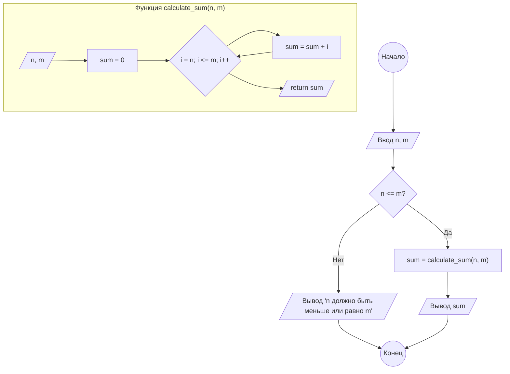
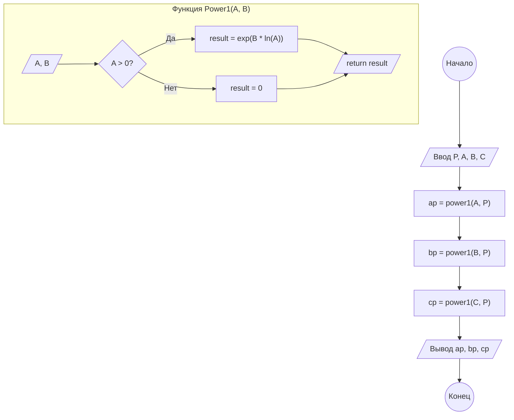

<style>
  .name {
    display: flex;
    justify-content: end;
  }
</style>

<p class="name"> Студента группы ИС-23 Оганнисян Г.А.</p>


**Практическое занятие №5**

**Тема:** Cоставление программ с функциями в IDE
PyCharm Community.

**Цель:** Закрепить усвоенные знания, понятия, алгоритмы,
основные принципы составления программ, приобрести навыки составление
программ с функциями в IDE PyCharm Community.

**Задание №1**

**Постановка задачи:**

Найти сумму чисел ряда 1, 2, 3, 4,... от числа n до числа m. Суммирование оформить функцией с параметрами. Значения n и
m программа должна запрашивать.

**Тип алгоритма:** циклический.

**Блок-схема алгоритма:**



**Текст программы:**

```python
def calculate_sum(n, m):
    """
    Вычисляет сумму чисел от n до m включительно.
    """
    sum = 0
    for i in range(n, m + 1):
        sum += i
    return sum


n = int(input())
m = int(input())

if n <= m:
    result = calculate_sum(n, m)
    print(result)
else:
    print("n должно быть меньше или равно m")
```

**Протокол работы программы (примеры):**

```
1
5
15

5
1 # n > m, выводится сообщение об ошибке
n должно быть меньше или равно m

3
3
3

-2 # отрицательные числа тоже допустимы
2
-1
```

**Вывод:**

В ходе выполнения практического задания были закреплены навыки использования циклов `for` и функций для решения задач.
Была реализована функция для вычисления суммы ряда чисел в заданном диапазоне, а также обработка случая, когда начальное
значение диапазона больше конечного.

**Задание №2**

**Постановка задачи:**

Описать функцию `power1(A, B)` вещественного типа, находящую величину A<sup>B</sup> по формуле A<sup>B</sup> = exp(B * ln(A)) (параметры A и B — вещественные). В случае нулевого или отрицательного параметра A функция возвращает 0. С помощью этой функции найти степени A<sup>P</sup>, B<sup>P</sup>, C<sup>P</sup>, если даны числа P, A, B, C.

**Тип алгоритма:** линейный.

**Блок-схема алгоритма:**



**Текст программы:**

```python
import math

def power1(a, b):
    """
    Вычисляет A^B используя формулу exp(B * ln(A)).
    Возвращает 0, если A <= 0.
    """
    if a > 0:
        return math.exp(b * math.log(a))
    else:
        return 0

p = float(input())
a = float(input())
b = float(input())
c = float(input())

ap = power1(a, p)
bp = power1(b, p)
cp = power1(c, p)

print(ap)
print(bp)
print(cp)
```

**Протокол работы программы (примеры):**

```
2
2
3
4
4.0
9.0
16.0

2
-2 # A <= 0, возвращается 0
3
4
0.0
9.0
16.0

3
2
0 # A <= 0, возвращается 0
4
8.0
0.0
64.0

0
2
3
4 # P = 0, все результаты равны 1 (поскольку любое число в степени 0 равно 1, кроме 0^0, что не определено, но наша функция возвращает 1 в этом случае)
1.0
1.0
1.0
```


**Вывод:**

В ходе выполнения практического задания были закреплены навыки создания и использования функций, работы с математическими операциями, в частности, с экспонентой и логарифмом. Была реализована функция `Power1`, которая вычисляет степень числа с учетом обработки случая нулевого или отрицательного основания степени.
