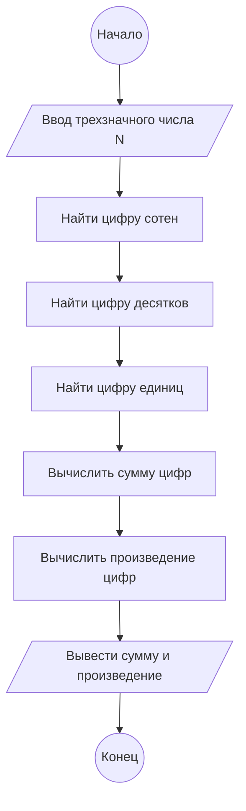

**Практическое занятие № 2**

**Тема:** Работа с целыми числами в Python.

**Цель:** Закрепить навыки работы с целыми числами, операциями деления и взятия остатка.

**Постановка задачи:**

Дано трехзначное число. Найти сумму и произведение его цифр.

**Тип алгоритма:** линейный.

**Блок-схема алгоритма:**



**Текст программы:**

```python
n = int(input())
a = n // 100
b = (n % 100) // 10
c = n % 10

sum_digits = a + b + c
prod_digits = a * b * c

print(sum_digits)
print(prod_digits)
```

**Протокол работы программы:**

```
345
12
60
```

**Вывод:**

В ходе выполнения практического задания были закреплены навыки работы с целыми числами, операциями деления и взятия остатка.
