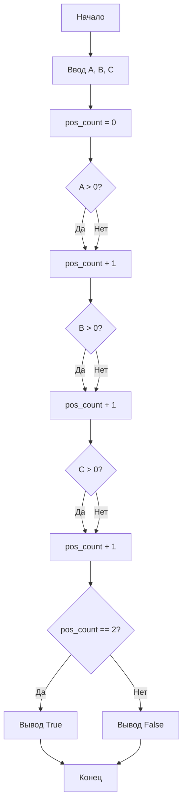

**Практическое занятие №3**

**Тема:**  Работа с условным оператором

**Цель:** Научиться использовать условный оператор для проверки условий.

**Постановка задачи:**

Даны три целых числа: A, B, C. Проверить истинность высказывания: «Ровно два из чисел A, B, C являются положительными».

**Тип алгоритма:** линейный с ветвлением.

**Блок-схема алгоритма:**




**Текст программы:**

```python
a = int(input())
b = int(input())
c = int(input())

pos_count = 0

if a > 0:
    pos_count += 1
if b > 0:
    pos_count += 1
if c > 0:
    pos_count += 1

if pos_count == 2:
    print("True")
else:
    print("False")

```

**Протокол работы программы (примеры):**

```
1
2
-3
True

-1
2
3
True

1
2
3
False

-1
-2
-3
False

1
-1
0
False
```

**Вывод:**

В ходе выполнения практического задания были закреплены навыки работы с условным оператором для проверки составных условий.


