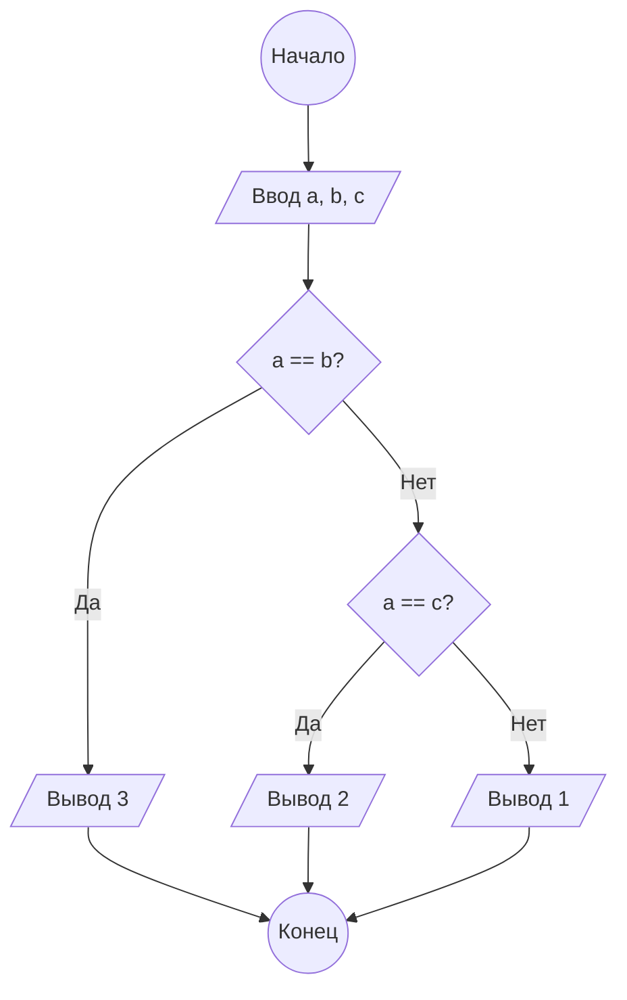

**Практическое занятие №3**

**Тема:**  Работа с условным оператором

**Цель:** Научиться использовать условный оператор для анализа данных.

**Постановка задачи:**

Даны три целых числа, одно из которых отлично от двух других, равных между собой. Определить порядковый номер числа, отличного от остальных.

**Тип алгоритма:** линейный с ветвлением.

**Блок-схема алгоритма:**



**Текст программы:**

```python
a = int(input())
b = int(input())
c = int(input())

if a == b:
    print(3)
elif a == c:
    print(2)
else:
    print(1)
```

**Протокол работы программы (примеры):**

```
1
1
2
3

1
2
1
2

2
1
1
1

5
5
5  # этот случай не обрабатывается по условию задачи, но код выдаст корректный с точки зрения кода ответ.
3
```

**Вывод:**

В ходе выполнения практического задания были закреплены навыки работы с условным оператором для анализа данных.
