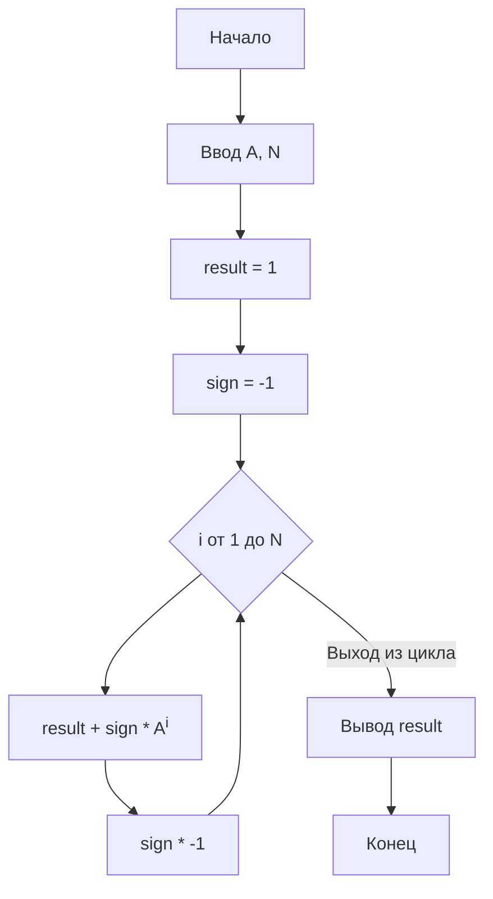

**Практическое занятие №4**

**Тема:** Циклы

**Цель:**  Научиться использовать цикл `for` для вычислений.

**Постановка задачи:**

Дано вещественное число A и целое число N (>0). Используя один цикл, найти значение выражения 1 - A + A<sup>2</sup> - A<sup>3</sup> + ... +(-1)<sup>N</sup>A<sup>N</sup>. Условный оператор не использовать.

**Тип алгоритма:** циклический.

**Блок-схема алгоритма:**



**Текст программы:**

```python
a = float(input())
n = int(input())

result = 1
sign = -1

for i in range(1, n + 1):
  result = result + sign * (a ** i)
  sign = sign * -1


print(result)
```

**Протокол работы программы (примеры):**

```
2
3
-3.0

0.5
3
0.625

1
5
0.0
```

**Вывод:**

В ходе выполнения практического задания были закреплены навыки использования цикла `for` для вычислений, а также применение  возведения в степень без использования условного оператора.
