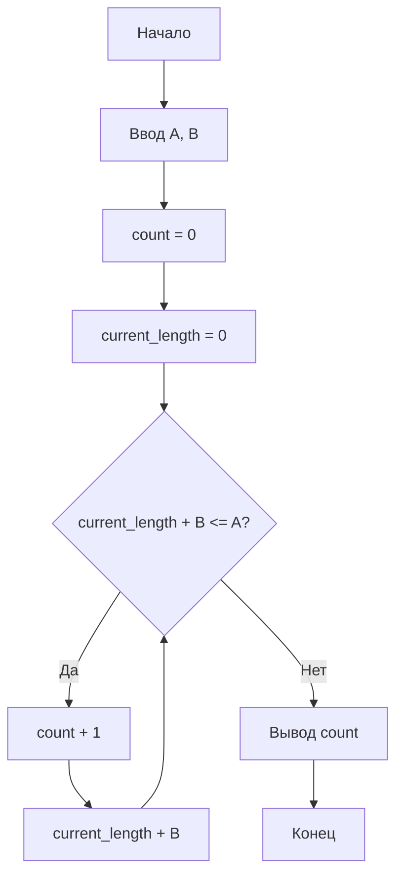

**Практическое занятие №4**

**Тема:** Циклы

**Цель:** Научиться использовать циклы для решения задач.

**Постановка задачи:**

Даны положительные числа A и B (A > B). На отрезке длины A размещено максимально возможное количество отрезков длины B (без наложений). Не используя операции умножения и деления, найти количество отрезков B, размещенных на отрезке A.


**Тип алгоритма:** циклический.

**Блок-схема алгоритма:**




**Текст программы:**

```python
a = float(input())
b = float(input())

count = 0
current_length = 0

while current_length + b <= a:
    count += 1
    current_length += b

print(int(count))
```

**Протокол работы программы (примеры):**

```
10
2
5

7.5
2.5
3

5
6 # Обратите внимание, что если B > A, то ни один отрезок не поместится, и результатом будет 0
0
```


**Вывод:**

В ходе выполнения практического задания были закреплены навыки использования циклов `while`  для решения задач без использования операций умножения и деления.
